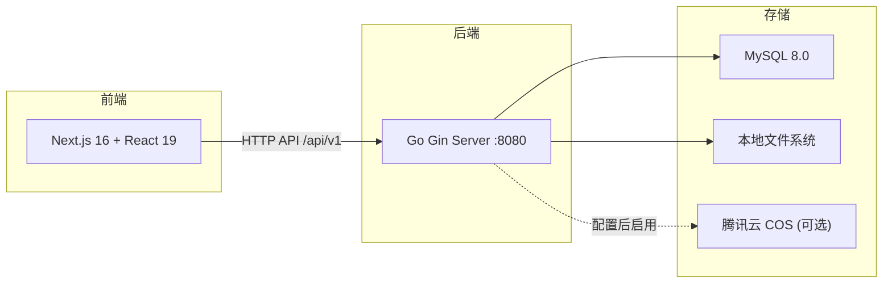
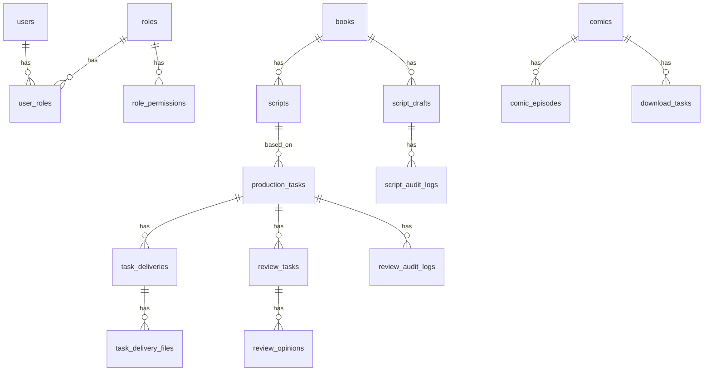
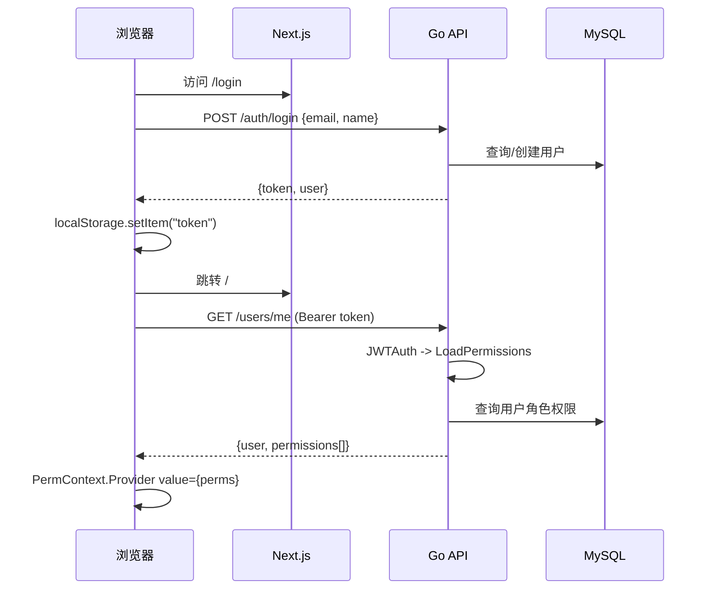
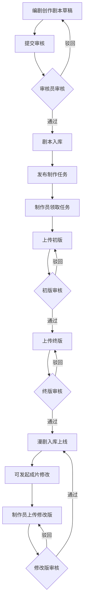
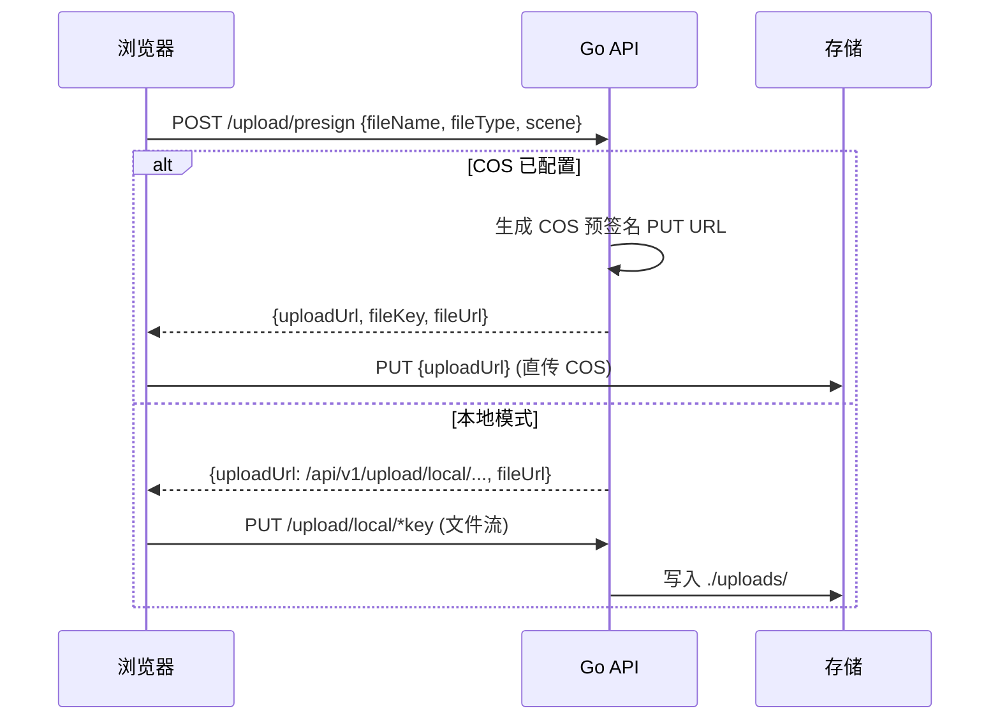

# 漫剧运营后台 — 技术架构文档

## 一、系统概览

漫剧运营后台是一个 B 端内容运营管理系统，支持书籍管理、剧本创作与审核、漫剧制作与审核、文件上传与下载等全流程业务。



## 二、技术栈

### 前端

- **框架**: Next.js 16.2.0 (App Router, Turbopack) + React 19.2.4
- **语言**: TypeScript 5.7.3 (strict mode)
- **样式**: Tailwind CSS 4.2 + tw-animate-css, PostCSS 经由 `@tailwindcss/postcss`
- **UI 组件**: shadcn/ui (new-york 风格, Radix UI 基础组件) + Lucide 图标
- **工具**: `clsx` + `tailwind-merge` 封装为 `cn()`, `date-fns`, `recharts`, `zod` + `react-hook-form`
- **路径别名**: `@/*` -> 项目根目录

### 后端

- **语言**: Go 1.22+ (编译为 `server.exe`)
- **框架**: Gin 1.10
- **ORM**: GORM 1.25 + MySQL Driver
- **认证**: JWT (HS256, `golang-jwt/jwt/v5`)
- **文件存储**: 本地文件系统 (`./uploads/`) / 腾讯云 COS (可选)
- **跨域**: gin-contrib/cors

### 数据库

- **MySQL 8.0.45** (免安装版, `D:\mysql-8.0\`)
- 已注册为 Windows 服务 `MySQL80` (自动启动)
- 数据库名: `comic_admin`, 字符集: `utf8mb4`

## 三、项目目录结构

```
漫剧运营后台/
├── app/                        # Next.js App Router 页面
│   ├── layout.tsx              # 根布局 (HTML shell, metadata)
│   ├── page.tsx                # 首页 -> AdminLayout (SPA shell)
│   ├── login/page.tsx          # 登录页
│   └── globals.css             # 全局样式
├── components/                 # 业务组件 + UI 基础组件
│   ├── admin-layout.tsx        # 主框架 (认证/权限/菜单/路由)
│   ├── sidebar.tsx             # 侧边栏导航
│   ├── header.tsx              # 顶部栏
│   ├── content-area.tsx        # 内容区 (动态加载业务组件)
│   ├── book-management.tsx     # 书籍管理
│   ├── script-management.tsx   # 剧本管理
│   ├── script-creation.tsx     # 剧本创作
│   ├── script-review.tsx       # 剧本审核
│   ├── comic-management.tsx    # 漫剧管理
│   ├── task-hall.tsx           # 漫剧制作 - 任务大厅
│   ├── my-task.tsx             # 漫剧制作 - 我的任务
│   ├── draft-review.tsx        # 漫剧审核
│   ├── download-center.tsx     # 下载中心
│   ├── user-management.tsx     # 用户管理
│   ├── role-management.tsx     # 角色管理
│   ├── video-thumbnail.tsx     # 视频播放器/缩略图
│   ├── image-thumbnail.tsx     # 图片预览/上传
│   ├── list-pagination.tsx     # 分页组件
│   └── ui/                     # shadcn/ui 基础组件 (57个)
├── lib/
│   ├── api.ts                  # HTTP 客户端 + 全部 API 接口
│   ├── permissions.ts          # 权限映射 + 工具函数
│   └── utils.ts                # cn() 工具函数
├── hooks/                      # 自定义 hooks
├── public/                     # 静态资源
├── styles/                     # 样式文件
├── backend/                    # Go 后端
│   ├── cmd/server/main.go      # 入口
│   ├── config.yaml             # 运行时配置
│   ├── internal/
│   │   ├── config/config.go    # 配置类型 + DSN
│   │   ├── handler/            # HTTP 处理器
│   │   │   ├── router.go       # 路由表
│   │   │   ├── auth.go         # 登录 + 当前用户
│   │   │   ├── user.go         # 用户管理
│   │   │   ├── role.go         # 角色 + 权限树
│   │   │   ├── book.go         # 书籍
│   │   │   ├── script.go       # 剧本库
│   │   │   ├── script_draft.go # 剧本草稿
│   │   │   ├── script_audit.go # 剧本审核
│   │   │   ├── production_task.go # 制作任务
│   │   │   ├── comic_review.go # 漫剧审核
│   │   │   ├── comic.go        # 漫剧 + 发起修改
│   │   │   ├── download.go     # 下载任务 + ZIP打包
│   │   │   └── upload.go       # 文件上传 (本地/COS)
│   │   ├── middleware/
│   │   │   ├── jwt.go          # JWT 签发/验证
│   │   │   ├── loadperms.go    # 加载用户权限
│   │   │   └── permission.go   # 权限校验 (可选)
│   │   ├── model/              # 数据模型 (GORM)
│   │   │   ├── db.go           # DB 初始化 + AutoMigrate
│   │   │   ├── user.go         # User, Role, UserRole, RolePermission
│   │   │   ├── book.go         # Book, StringSlice
│   │   │   ├── script.go       # Script, ScriptDraft, ScriptAuditLog
│   │   │   ├── comic.go        # Comic, ComicEpisode
│   │   │   ├── production.go   # ProductionTask, TaskDelivery, TaskDeliveryFile
│   │   │   ├── review.go       # ReviewTask, ReviewOpinion, ReviewAuditLog
│   │   │   └── download.go     # DownloadTask
│   │   └── pkg/
│   │       ├── response/       # 统一响应格式
│   │       ├── pagination/     # 分页解析
│   │       ├── cos/            # 腾讯云 COS 客户端
│   │       ├── idgen/          # 雪花 ID 生成
│   │       └── wordcount/      # 字数统计
│   ├── migrations/             # SQL 迁移脚本
│   └── uploads/                # 本地上传文件
│       ├── images/covers/      # 封面图
│       ├── images/copyright/   # 版权证明
│       ├── videos/drafts/      # 初版视频
│       ├── videos/final/       # 终版视频
│       └── downloads/          # ZIP 打包文件
├── .env.local                  # 环境变量 (API_BASE)
├── next.config.mjs             # Next.js 配置
├── tsconfig.json               # TypeScript 配置
└── package.json                # NPM 配置
```

## 四、数据库设计

### ER 关系图



### 数据表清单 (17 张表)

- **users** (4) — 用户, email 唯一, 状态 启用/禁用
- **roles** (5) — 角色, name 唯一 (超级管理员/编剧/制作员/审核员/提审员)
- **user_roles** (4) — 用户-角色关联 (多对多)
- **role_permissions** (93) — 角色-权限 (45 个权限点)
- **books** (15) — 书籍/小说, 含全文 content (longtext)
- **scripts** (4) — 已发布剧本
- **script_drafts** (5) — 剧本草稿 (待提审/审核中/已通过/驳回修改)
- **script_audit_logs** (17) — 剧本审核日志
- **production_tasks** (10) — 制作任务 (制作/修改)
- **task_deliveries** (22) — 交付物 (初版/终版/修改版)
- **task_delivery_files** (361) — 交付文件明细
- **review_tasks** (10) — 审核任务 (初版/终版/修改版审核)
- **review_opinions** (22) — 审核意见 (支持文字+图片)
- **review_audit_logs** (55) — 审核操作日志 (含意见快照)
- **comics** (3) — 漫剧成品
- **comic_episodes** (18) — 漫剧集数 (有字幕/无字幕 URL)
- **download_tasks** (4) — 下载任务 (ZIP 打包)

## 五、API 接口设计

### 统一响应格式

```json
{ "code": 0, "message": "success", "data": {} }
```
分页接口: `data: { "total": 100, "list": [...] }`

### 认证

- **登录**: `POST /api/v1/auth/login` — 邮箱登录, 首次自动注册, 返回 JWT
- **当前用户**: `GET /api/v1/users/me` — 返回用户信息 + 权限列表

### 接口总览 (48 个)

**公开接口 (2)**
- `POST /auth/login`, `GET /health`

**用户与角色 (6)**
- `GET /users`, `PUT /users/:id`, `GET /roles`, `POST /roles`, `PUT /roles/:id`, `GET /permissions/tree`

**书籍 (2)**
- `GET /books`, `GET /books/:id`

**剧本草稿 (7)**
- `GET /script-drafts`, `GET/POST/PUT/DELETE /script-drafts/:id`, `POST /:id/submit`, `GET /:id/audit-logs`

**剧本审核 (5)**
- `GET /script-audit/hall`, `GET /script-audit/mine`, `POST /:id/claim`, `POST /:id/review`, `PUT /:id/save`

**剧本库 (4)**
- `GET /scripts`, `GET /scripts/:id`, `POST /:id/production-tasks`, `POST /:id/remakes`

**制作任务 (9)**
- `GET /production-tasks/hall`, `GET /mine`, `GET /:id`, `POST /:id/claim`, `POST /:id/cancel`
- `GET /:id/audit-logs`, `GET /:id/deliveries`, `POST /:id/deliveries`, `PUT /:id/deliveries/draft`

**漫剧审核 (5)**
- `GET /comic-review/tasks`, `GET /:id`, `POST /:id/review`, `PUT /:id/save`, `GET /:id/logs`

**漫剧 (4)**
- `GET /comics`, `GET /:id`, `POST /:id/download`, `POST /:id/revisions`

**下载中心 (3)**
- `GET /download/tasks`, `GET /:id/url`, `POST /:id/retry`

**文件 (2)**
- `POST /upload/presign`, `PUT /upload/local/*key`

**静态文件 (2)**
- `GET /uploads/*` (图片/视频), `GET /dl/*filepath` (ZIP 下载, 支持断点续传)

## 六、认证与权限体系

### 认证流程



### 权限控制

**后端**: JWT 中间件 -> 加载权限到 context -> 可选的 `RequirePerm` 中间件 (路由级)

**前端**: 
- **页面级**: `lib/permissions.ts` 的 `MENU_PERMISSION_MAP` 映射菜单 key 到权限 key, `AdminLayout` 过滤侧边栏菜单
- **按钮级**: `usePerm(key)` hook 返回 boolean, 各组件用 `{canXxx && <Button />}` 控制按钮可见性
- **拦截规则**: 无权限菜单不显示; `selectedKey` 自动重定向到有权限的首个页面

### 权限点 (45 个, 5 大模块)

- **资源管理** (12): book.list/script/detail/detail_script, script.list/detail/publish/remake, comic.list/detail/download/revise
- **剧本创作** (4): list, edit, delete, log
- **漫剧制作** (11): hall.list/detail/take/cancel/log, my.list/detail/upload1/upload2/upload3/log
- **审核管理** (12): script.hall_list/hall_detail/hall_take/hall_log/my_list/my_detail/my_review/my_log, comic.list/detail/review/log
- **系统设置** (6): user.list/add/edit, role.list/add/edit

### 角色权限配置

- **超级管理员**: 45 个全部权限
- **编剧** (11): 书籍管理 + 剧本管理(列表/详情/二创) + 剧本创作
- **制作员** (11): 漫剧制作全部
- **审核员** (15): 剧本管理(列表/详情/发布) + 剧本审核 + 漫剧审核
- **提审员** (8): 漫剧管理 + 漫剧审核

## 七、核心业务流程

### 剧本创作 -> 审核 -> 制作 -> 审核 -> 上线



### 审核任务生命周期

- 同一制作任务的每种审核类型 (初版/终版/修改版) **只有一条** ReviewTask
- 驳回后重新提交: 复用同一条 ReviewTask, 状态从"驳回修改"改回"审核中"
- 审核意见保留, 不会因重新提交而丢失

### 下载打包流程

1. 用户触发下载 -> 后端异步 goroutine 打包
2. 从漫剧集数中收集文件, 按命名规则创建文件夹
3. 生成 ZIP (Store 模式, 不压缩, 支持 ZIP64)
4. 存入 `uploads/downloads/`, 记录 URL, 72h 有效期
5. 前端通过 `/dl/*` 路由下载, 支持 Range (断点续传)

## 八、文件上传架构



## 九、前端路由机制

系统采用 **SPA 式 selectedKey 切换**, 而非 Next.js 文件路由:

- `/` — AdminLayout (主框架, 含侧边栏/内容区)
- `/login` — 登录页 (唯一独立路由)
- 业务页面通过 `ContentArea` 中 `selectedKey` 条件渲染, 使用 `next/dynamic` 懒加载
- 优势: 切换页面不刷新, 保持侧边栏/Header 状态

## 十、环境配置

### 前端 `.env.local`

```
NEXT_PUBLIC_API_BASE=http://192.168.73.100:8080/api/v1
```

### 后端 `config.yaml`

```yaml
server:
  port: 8080
  mode: debug
database:
  host: 127.0.0.1
  port: 3306
  user: root
  password: ""
  dbname: comic_admin
  charset: utf8mb4
jwt:
  secret: "comic-admin-jwt-secret-change-me"
  expire_hours: 24
cos:
  # 留空 = 本地存储; 填写 = COS 上传
  secret_id: ""
  secret_key: ""
  bucket: ""
  region: ""
  base_url: ""
```

### MySQL `D:\mysql-8.0\my.ini`

```ini
[mysqld]
basedir=D:/mysql-8.0
datadir=D:/mysql-8.0/data
port=3306
character-set-server=utf8mb4
max_connections=200
sort_buffer_size=8M
innodb_sort_buffer_size=8M
```

## 十一、启动与部署

### 开发环境启动

1. MySQL 服务已注册为 Windows 自动启动 (`MySQL80`)
2. 启动后端: `cd backend && ./server.exe`
3. 启动前端: `npm run dev` (监听 `0.0.0.0:3000`)

### 局域网访问

- 前端: `http://192.168.73.100:3000`
- 后端: `http://192.168.73.100:8080`
- 需配置: `next.config.mjs` 的 `allowedDevOrigins` + Windows 防火墙放行 3000/8080 端口
